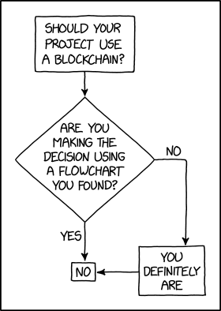

<div align="center">
<h1>blockrypt</h1>

samarth kulshrestha


<br>


<br/><br/><br/>

<br/><br>
</div>

## Introduction



"The fastest way to learn how blockchains work is to build one", says
[Hackernoon](https://hackernoon.com/). **Blockrypt** is a blockchain that I
built to understand how blockchains function.

A blockchain is an immutable, sequential chain of records called Blocks.
They can contain transactions, files or any data you like, really. But the
important thing is that they’re chained together using hashes.

## Requirements

+ Make sure that [Python](https://www.python.org/) v3.6+ (along with
[pip](https://pypi.org/project/pip/)) is installed.

+ Install the required pip packages by running:

```
pip install Flask==2.3.2 requests==2.29.0
```

+ An HTTP Client (for example[Postman](https://www.postman.com/downloads/) or
[cURL](https://curl.se/)) is also needed.

## Running

+ Clone the repository.

```
git clone https://github.com/samarthkulshrestha/blockrypt.git
```

+ Enter the `blockrypt` directory.

```
cd blockrypt/
```

+ Run Blockrypt.

```
python src/blockrypt.py
```

You will be asked for a port number. Here, enter the port you want to run
Blockrypt on. The port must be idle.

## API

+ `/chain`: Returns the entire blockchain.
    + method: GET

+ `/mine`: Runs the proof of work algorithm and mines a new block on the chain.
    + method: GET

+ `/transactions/new`: Adds a transaction to a block.
    + method: POST
    + data:
    ```json
    {
        "sender": "<sender's address>",
        "recipient": "<recipient's address>",
        "amount": 7
    }
    ```

+ `/nodes/register`: Registers new nodes on the blockchain.
    + method: POST
    + data:
    ```json
    {
        "nodes": ["http://127.0.0.1:6969"]
    }
    ```
+ `/nodes/resolve`: Runs the consensus algorithm to determine the authoritative
  chain.
    + method: GET

## Contribute

 [](https://makeapullrequest.com)
 [](https://peps.python.org/pep-0008/)

+ I <3 pull requests and bug reports!
+ Don't hesitate to [tell me my code-fu sucks](https://github.com/samarthkulshrestha/blockrypt/issues/new), but please tell me why.

## License

Blockrypt is licensed under the MIT License.
Copyright (c) 2023 Samarth Kulshrestha.
