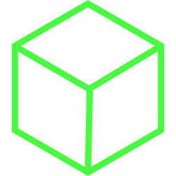

<div align="center">
<h1>blockrypt</h1>

samarth kulshrestha


<br>


<br/><br/><br/>

<br/><br>
</div>

## Introduction


"The fastest way to learn how blockchains work is to build one", says
[Hackernoon](https://hackernoon.com/). **Blockrypt** is a blockchain that I
built purely to understand how blockchains work.

## Requirements

+ Make sure that [Python](https://www.python.org/) v3.6+ (along with
[pip](https://pypi.org/project/pip/)) is installed.

+ Install the required pip packages by running:

```
pip install Flask==2.3.2 requests==2.29.0
```


